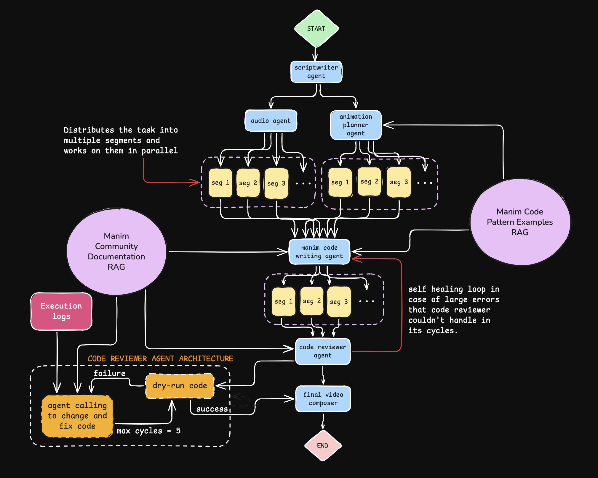

# Auto 3Blue1Brown Short Video Generator

A multi-agent AI orchestration system that autonomously generates educational mathematics and science videos in the style of 3Blue1Brown. Built with Multi Agent orchestration (LangGraph), advanced RAG pipelines, and intelligent code synthesis capabilities. The videos generated are of high mathematical accuracy.

## Example Output on derivatives created by the agents (without any human intervention):
Make sure to turn up the audio

[Watch the example video](https://github.com/user-attachments/assets/05ca29f9-49cc-4303-ba8b-4e23647b646a)

## Overview

This project leverages **multi-agent orchestration** and **retrieval-augmented generation (RAG)** to create complete educational videos from a single topic input. The system implements a sophisticated **autonomous agent workflow** with **self-healing code generation**, combining ChatGPT and Claude models in a coordinated pipeline.

Key technical details:
- **Multi-Agent State Machine**: LangGraph-orchestrated workflow with specialized AI agents
- **Dual RAG Architecture**: Separate vector stores for code patterns and API documentation
- **Iterative Self-Correction**: Autonomous code review agent with documentation-grounded error recovery
- **Production-Ready Pipeline**: Handles scriptwriting, neural TTS, animation synthesis, code generation, validation, and video composition end-to-end


## Architecture

**Multi-Agent Orchestration Pipeline** powered by LangGraph state machine:



**Technical Stack**: LangGraph orchestration | Dual RAG (ChromaDB) | Multi-model inference (GPT-5 + Claude Sonnet 4.5) | Manim rendering engine | FFmpeg composition

## Features

- **Autonomous Script Synthesis**: LLM-powered content generation with intelligent segmentation
- **Neural Text-to-Speech**: State-of-the-art voice synthesis using OpenAI's TTS models
- **RAG-Enhanced Animation Planning**: Retrieval-augmented generation querying 3Blue1Brown's production codebase
- **AI Code Generation**: Claude Sonnet 4.5-powered Manim code synthesis with style transfer learning
- **Self-Healing Code Review**: Multi-cycle autonomous debugging with documentation-grounded error recovery
- **Intelligent Video Composition**: Automated rendering orchestration with quality optimization

## Example video given in the repo:

[Watch the example video](derivatives_final_video.mp4)

*Complete AI-generated educational video on calculus derivatives - zero human intervention required*

## Prerequisites

- Python 3.13+
- FFmpeg
- LaTeX distribution (for mathematical equations)
- Manim Community Edition
- OpenAI API key
- Anthropic API key

## Installation

### 1. Clone the repository

```bash
git clone https://github.com/xtechsouthie/manim-shorts.git
cd manim-shorts
```

### 2. Install dependencies

Using uv (recommended):
```bash
uv sync
```

Or using pip:
```bash
python -m venv .venv
source .venv/bin/activate  # On macOS/Linux
pip install -e .
```

### 3. Install system dependencies

**for macOS:**
```bash
brew install ffmpeg
brew install --cask mactex-no-gui
```

### 4. Set up environment variables

Create a `.env` file:
```bash
OPENAI_API_KEY=your_openai_api_key_here
ANTHROPIC_API_KEY=your_anthropic_api_key_here
```

### 5. Create vector databases

Generate the Manim code examples database:
```bash
mkdir data
cd data
git clone https://github.com/3b1b/videos #clone the 3b1b videos repo for RAG data examples.
cd ..
uv run make_vector_db.py #run this to make the vector database of code examples
```

Generate the Manim documentation database:
```bash
uv run docs_vector_db.py #run this to make the vector database of manim community docs
```

This will create `chroma_manim_db` and `chroma_docs_db` directories containing the RAG vector stores.

## Usage

### Basic Usage

```bash
uv run main.py
```

Enter your topic when prompted:
```
Enter the video topic you want to explore: what is a derivative in calculus?
```

### Output Structure

```
video_files/
├── audio/              # Generated TTS audio files
├── manim_script/       # Generated Manim Python scripts
├── video/              # Rendered video segments
└── final_video.mp4     # Complete merged video
```

## Configuration

### Model Selection

Edit `main.py` to change LLM providers:

```python
openai_llm = ChatOpenAI(model="gpt-5-mini", temperature=0.6)
claude_llm = ChatAnthropic(model="claude-sonnet-4-5-20250929", temperature=0.6)
```

### Video Quality Settings

Edit `src/composer.py` to adjust rendering quality:

```python
final_clip.write_videofile(
            str(final_path),
            codec='libx264',
            audio_codec='aac',
            fps=30,
            preset='medium',
            audio_bitrate='192k',
            bitrate="3000k",  
            threads=8,
        )
```

## Dual RAG Architecture

The system implements a **production-grade dual RAG pipeline** with specialized vector stores:

### 1. Code Pattern RAG (`chroma_manim_db`)
- **Source**: 3Blue1Brown's production animation codebase (2019-2024)
- **Embeddings**: OpenAI text-embedding-3-small (1,234 chunks)
- **Purpose**: Style transfer learning and pattern matching
- **Usage**: Animation planning agent + Code generation agent
- **Retrieval**: Top-k semantic search with relevance scoring

### 2. Documentation RAG (`chroma_docs_db`)
- **Source**: Manim Community official documentation
- **Embeddings**: OpenAI text-embedding-3-small
- **Purpose**: API-grounded error recovery and validation
- **Usage**: Code review agent's self-healing loop
- **Retrieval**: Error-conditioned semantic search with LLM summarization

## Autonomous Code Review System

**Self-healing code generation** with intelligent error recovery:

1. **Validation**: Executes generated Manim code with `--dry_run` flag
2. **Error Capture**: Extracts stack traces and error logs
3. **LLM Summarization**: GPT-5 analyzes and categorizes errors
4. **RAG-Grounded Retrieval**: Queries documentation vector store for relevant API fixes
5. **Code Synthesis**: Claude generates corrected code with error context
6. **Iterative Loop**: Repeats for up to 5 cycles with error history tracking

**Production Features**:
- Error deduplication across cycles
- Syntax validation before execution
- Code completeness checks (imports, class structure, balanced parentheses)

## Troubleshooting

### "No module named 'manim'"
```bash
pip install manim
```

### "LaTeX Error: File not found"
Ensure LaTeX is installed and in PATH:
```bash
which latex
```

### "Rate limit exceeded"
The system includes automatic retry with exponential backoff. Adjust delays in:
- `src/manim_agent.py`: Line 142 (Manim generation delays)
- `src/reviewer.py`: Line 18 (Code review retries)

### Vector stores not found
Run the database creation scripts:
```bash
uv run make_vector_db.py
uv run docs_vector_db.py
```

### Segment duration mismatch
The system automatically adjusts video length to match audio. Check logs for warnings about timing mismatches.

## Project Structure

```
.
├── src/
│   ├── state.py           # Pydantic state models
│   ├── scripts.py         # Script generation
│   ├── audio.py           # TTS generation
│   ├── ani_planner.py     # Animation planning
│   ├── manim_agent.py     # Manim code generation
│   ├── reviewer.py        # Code review system
│   └── composer.py        # Video rendering and composition
├── data/
│   └── videos/            # 3Blue1Brown source code
├── chroma_manim_db/       # RAG database for code examples
├── chroma_docs_db/        # RAG database for documentation
├── make_vector_db.py      # Creates code examples database
├── docs_vector_db.py      # Creates documentation database
├── main.py                # Main entry point
└── pyproject.toml         # Dependencies
```

## Dependencies

### Core
- `langgraph` - Workflow orchestration
- `langchain` - LLM framework
- `manim` - Animation engine
- `moviepy` - Video composition
- `openai` - TTS and embeddings

### RAG
- `chromadb` - Vector database
- `beautifulsoup4` - Documentation scraping

### Full list
See `pyproject.toml` for complete dependency list.

## Limitations

- Requires substantial API credits (GPT-5-mini + Claude Sonnet)
- Video generation takes approx. 15 minutes per 3-minute video
- Manim code may require manual fixes for very complex visualizations
- Limited to mathematical and scientific topics suitable for Manim
- Minor problems like overlapping objects and discoloured/irregular colours of text
- Faces problems with video animation and spoken audio word syncing. 

## Contributing

Contributions are welcome. Please ensure:
- Code follows existing style conventions
- New features include appropriate error handling
- Vector databases are not committed to git
- API keys are never hardcoded

## License

MIT License - see LICENSE file for details

## Acknowledgments

- Grant Sanderson (3Blue1Brown) for Manim and inspiration and his code(used for reference and as examples)
- Manim Community Edition maintainers


**Note**: This project requires access to 3Blue1Brown's source code repository for the RAG system. The code is available at https://github.com/3b1b/videos but is not included in this repository.
